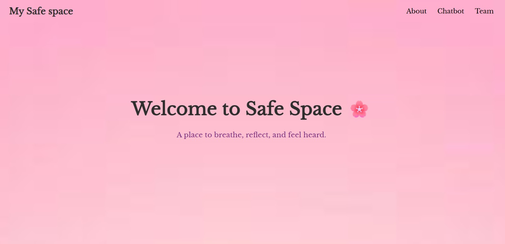
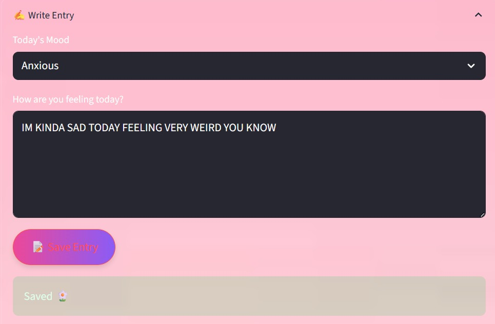
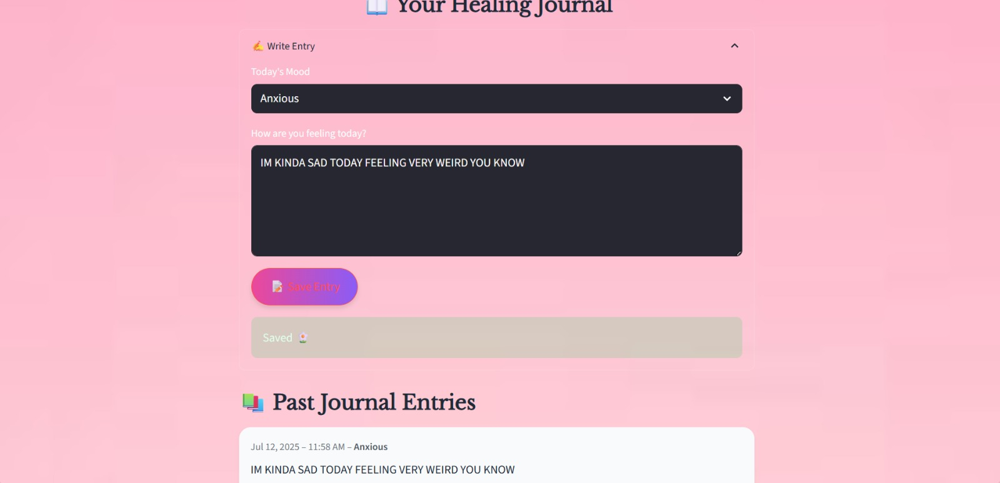
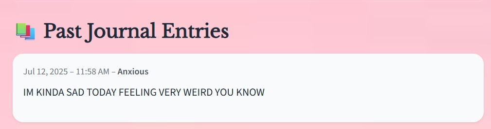

 🧠 Safe Space – AI Mental Health Chatbot

## 🌸 Overview
Safe Space is an AI-powered mental health chatbot designed to provide real-time, empathetic, and personalized emotional support for students. It acts as a digital companion offering a safe, anonymous, and judgment-free environment.

---

## 🎯 Problem Statement
Students face increasing levels of stress, anxiety, and burnout due to academic pressure and post-pandemic challenges. Traditional mental health support systems are limited by:
- Restricted availability
- Social stigma
- Lack of real-time support

Safe Space aims to bridge this gap using AI.

---

## 🚀 Key Features
- 💬 Real-time conversational AI support  
- 😊 Mood detection (Anxious, Sad, Calm, etc.)  
- 🧘 Guided meditation & affirmations  
- 📓 Journaling with mood tracking  
- 🔍 Semantic search using FAISS  
- 🧠 Context-aware responses using LLMs  

---

## 🏗️ System Architecture

### 🔹 Workflow
1. User Input  
2. Mood Detection (Mistral via Ollama)  
3. Text Embedding (Google Embeddings)  
4. FAISS Semantic Search  
5. LLM Response Generation (LLaMA 3)  
6. Personalized Output Display  

---

## 🛠️ Tech Stack
- *Languages:* Python  
- *AI/ML:* NLP, LLMs (LLaMA, Mistral)  
- *Frameworks:* Streamlit, Django  
- *Libraries:* LangChain, FAISS  
- *Tools:* Ollama, Google Embeddings  
- *Frontend:* HTML, CSS, JavaScript  

---

## 📊 Key Achievements
- Real-time emotionally aware responses  
- 24/7 availability  
- Personalized interaction using semantic search  
- Scalable and modular architecture  

---

## 📸 Project Demo
(Add your screenshots below)

---

## 👩‍💻 My Contribution
- Designed complete chatbot architecture  
- Worked on NLP pipeline and mood detection  
- Implemented response generation workflow  
- Developed UI and user interaction flow  

---

## ⚠️ Note
Due to system constraints, the full source code is not available. This repository showcases the project architecture, workflow, and outputs.

---

## 🔮 Future Scope
- LLM fine-tuning for better personalization  
- Multilingual support  
- Offline functionality  
- Integration with real counselors  

---

## ❤️ Conclusion
Safe Space provides a scalable, AI-driven solution to mental health challenges, ensuring students receive timely and stigma-free support anytime, anywhere.
## 📷 Screenshots

